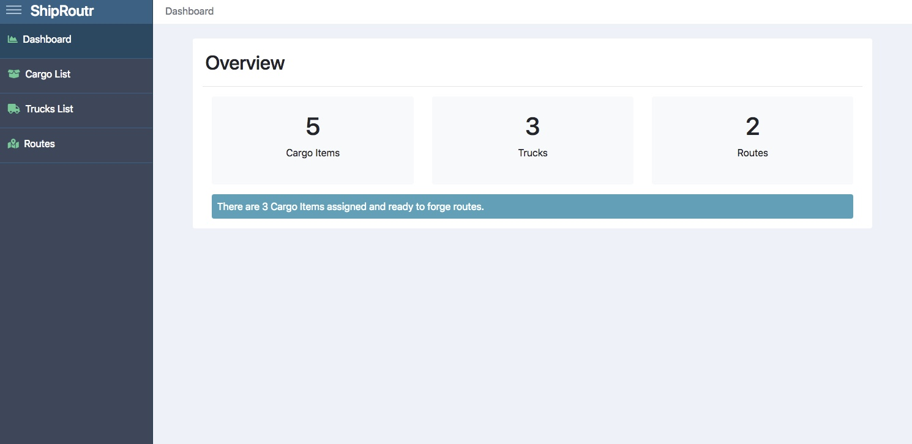
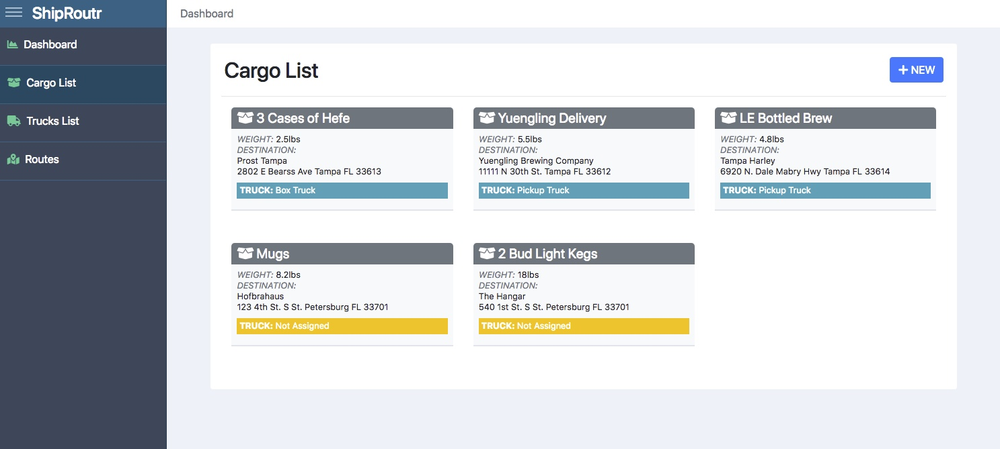
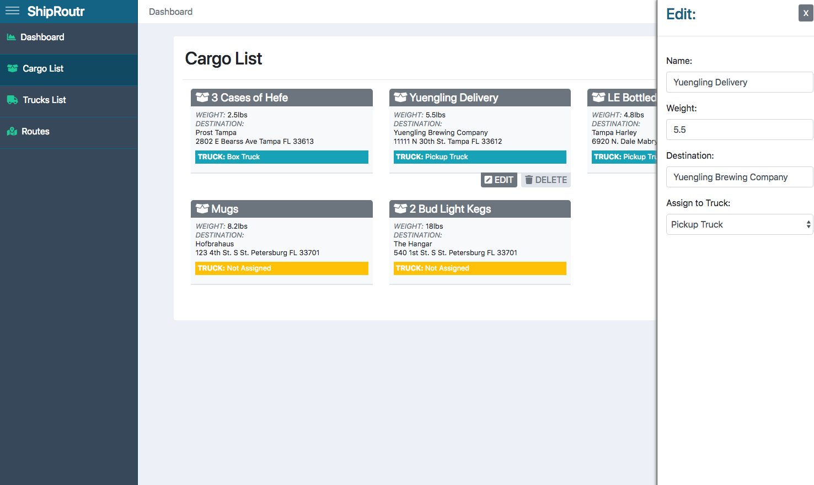
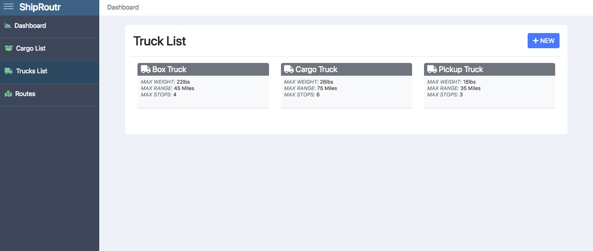
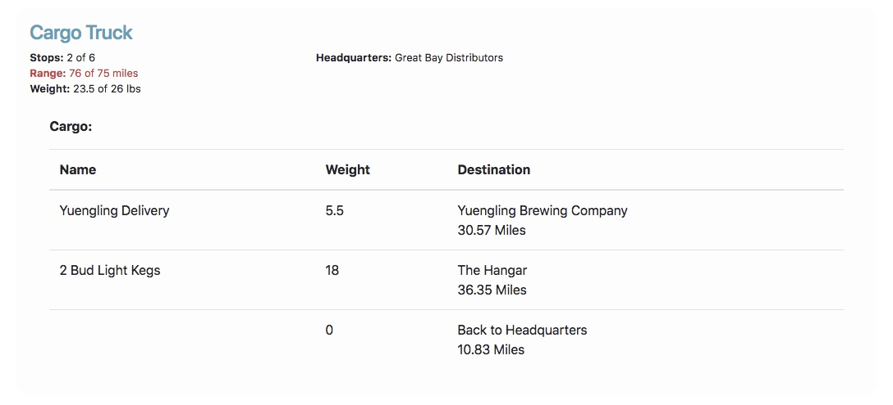

# Cargo Route

> Little Vue JS App to maintain cargo items, trucks and routes. Proof of concept.

> Integration with Google Maps routing and distance APIs not posted

**Demo**

http://dubrod.me/vue/cargo-route/cargo

**Scope Logic**

1. Limit Shipment by Weight
2. Limit Route by Distance [ToDo]
3. Limit Route by # of Stops
4. Add/Edit/Delete Trucks with Name, Max Weight, Max Range, Max Stops
5. Add/Edit/Delete Cargo with Name, Weight, Destination Details (ToDo)

**Views**











## Build Setup

``` bash
# install dependencies
npm install

# serve with hot reload at localhost:8080
npm run dev

# build for production with minification
npm run build

# build for production and view the bundle analyzer report
npm run build --report
```
